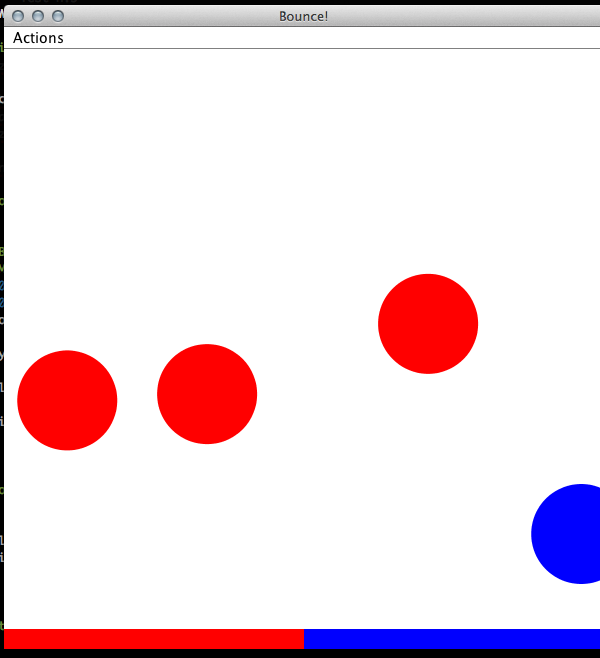

## Java 11/12 - Test n.5 del 14 Giugno 2012

Realizzare un pannello con il "pavimento" di due colori, inserito in un frome dotato di JMenuBar che risponda al seguente comportamento:

* tramite l'azione **New** del menu **Actions**, viene fatta cadere una pallina dal soffito, con ascissa casuale e colore casuale **scelto tra uno dei due del pavimento**;
* le palline hanno accelerazione verticale casuale [non ce ne voglia Galileo];
* quando le pallline toccano terra, se cadono sulla porzione del proprio colore rimbalzano verso l'alto, altrimenti vengono cancellate;
* tramite l'azione **Clear** del menu **Actions**, vengono cancellate tutte le palline.

Bonus: l'azione **Swap** scambia i colori dei due pavimenti.

Buon lavoro,

*D.*